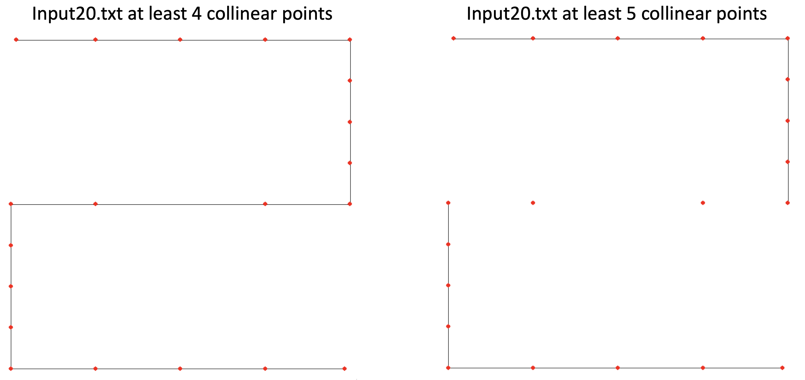
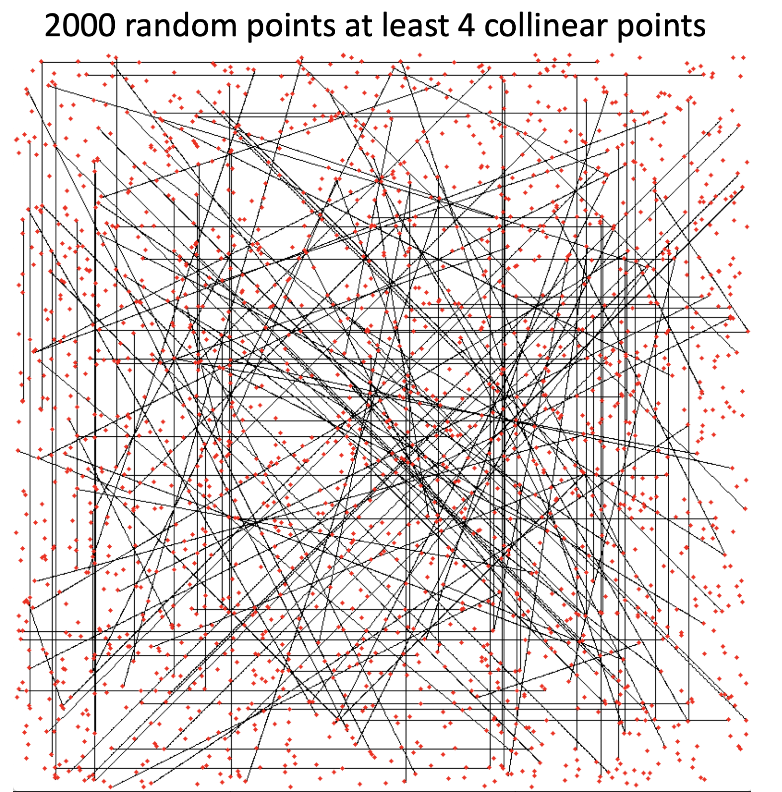

# Pattern Recognition: Find all unique segments made with 2d collinear points (python/pyspark)

Pattern recognition algorithm. Finds all unique line segments made with at least k collinear points found in a set of
2D points expressed in cartesian coordinates. k must be greater than or equal to 3 (why?, becuase any pair of points defines a line, so the concept of collinearity is not well define for two points)

Examples of the output:






## Getting Started

The python code (fastSearchCollinearPoints.py) and pyspark code (pysparkSearchCollinearPoints.py) are independent from each 
other and each one represents an algorithm that solves this task.

The complexity of the python version is ```O(nln(n))``` whereas the complexity of the pyspark version is ```O(n^2)``` 
where n is the size of the input


To run the code using your own data you must provide a plain text file in the following format

```
3
12 24
31 45
45 89
```

the first line indicates the number of points in the file. Inside the data folder there are many test cases to play around. 

You can also use a random generator functions to generate the points at random. Search for the following snippets of code to
use them

[a snippet of the code inside fastSearchCollinearPoints.py]
```
# * Random points generator
# Instead of read the data from files, uncomment the lines below to generate them randomly
# and set k to search for at leat k collinear points
# k = 4
# points = randomPointsGenerator.random_points(2000)
```


[a snippet of the code inside pysparkSearchCollinearPoints.py]
```
# * Random points generator
# Instead of read the data from a file, uncomment the line below to generate them randomly
# k = 4
# pts, points_to_draw = points_from_random(200)
```
---
## Usage

For the python code you can use the followimg command

```python
python fastSearchCollinearPoints.py k filename
```

Whete k is the number of collinear point you want to detect and ```filename``` is the name of the file you want to inspect (this file must be inside the data direcctory). 

If you don't provide any arguments, the ones hardcoded inside the code will be used instead. You can use this option if you don't want to provide any argument. You can find where to select files manually in the line 100 which contains the following piece of code

```python
except:
    k = 4
    file_name = 'input20.txt'          
    path      = Path.cwd()
    file_path = path / 'data' / file_name
```

For the pyspark version

```python
spark-submit pysparkSearchCollinearPoints.py
```

to choose the files from the data folder you can use the function points_from_file (see the line 147 of the file
pysparkSearchCollinearPoints.py for more info)


## Installation

To run the python code you must have install the libraries: sys, numpy, pathlib, pygame 

If you have installed anaconda, you can get pygame running the following code

```python
pip install pygame 
```

To run the pyspark code you must have intalled properly spark and pyspark


---

## FAQ

- I have troubles with pygame, Can I avoid used it?
    - If you have troubles with pygame, you can rip off all the references to the stddraw.py file. You still have
    access to the list of the collinear points found and you can use this data to feed another plotting library like matplotlib. 

- Why do you choose pygame instead of matplotlib?
    - Because in my opinion pygame offers a cleaner canvas to represent the results and it can render thousand of points 
      and lines more efficiently than matplotlib 

- Does matplotlib will be supported in the future?
    - Maybe, if I have time, I certainly do it
    
- will it be useful to look inside this code or it is of that kind of unreadable and ugly code?
    - Yeah, this code has some nice explanations and you certanly should see it if you want to learn to do similar things, particularly the pyspark 
      version. The code written in python was a clever algorithm that I wrote for the Coursera course Algorithms I and I want to 
      share it with the world. (The original version of this code was written in java, so if you are taking the Algorithms I 
      course this python version don't will be graded by the autograder)
---

## Acknowledgments and Credits

* The test data was taken from the assignment 3 of the Coursera course [Algorithms I](https://www.coursera.org/learn/algorithms-part1)
  offered by the Princeton University
* The stddraw.py file was taken from the texbooksite [Programming in python an interdiciplinary approach](https://introcs.cs.princeton.edu/python/code/) 
  
---

## License

[](http://badges.mit-license.org)

- **[MIT license](http://opensource.org/licenses/mit-license.php)**
